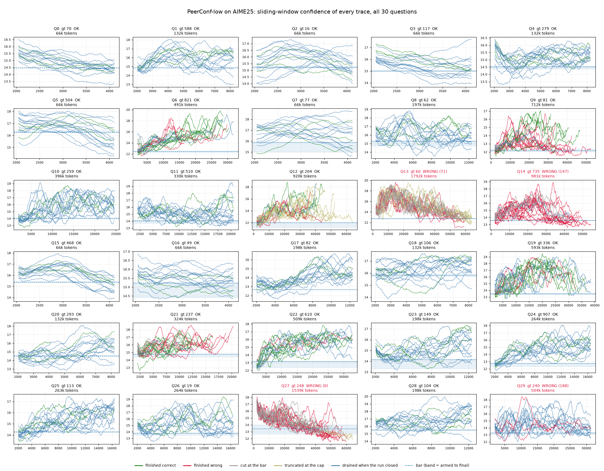

# AIME25

PeerConf-low on all 30 questions. DeepConf-low at the same budget is still to run.

## Results

| Model | Dataset | Token | Time | Acc | Mean token/Q |
|---|---|---|---|---|---|
| DeepSeek-8B | AIME25 (Q0-29) | 11.66M | 145 min | 86.7% | 389K |
| | correct subset (26 Q) | 6.85M | 72 min | - | 263K |

Budget 32 traces/question, 16 seats, 64k-token cap, one run per question.
Time = generation wall-clock on 2x H200 SXM, excludes server startup.

The four wrong answers (Q13, Q14, Q27, Q29) cost 4.82M tokens, 41% of the run,
so a correct answer averages 263K tokens and a wrong one averages 1.20M.

## If we counted only the first k votes

Accuracy against the number of finished traces allowed to vote, replayed from
the same run. Nothing else changes.

| k | Acc | Voter token | Est. total | vs full run |
|---|---|---|---|---|
| 3 | 24/30 (80%) | 1.47M | 3.67M | 31% |
| 4 | 25/30 (83%) | 1.78M | 4.44M | 38% |
| **8** | **26/30 (87%)** | **3.01M** | **7.52M** | **64%** |
| 10 | 26/30 (87%) | 3.51M | 8.78M | 75% |
| all (32) | 26/30 (87%) | 4.66M | 11.66M | 100% |

Accuracy saturates at k=8: every vote after the eighth changed nothing, so
stopping there costs about 36% fewer tokens at the same 26/30.

Voter token counts only the traces that voted. Those were 40% of everything the
run generated, the rest going to traces that were cut, truncated or drained, so
est. total scales the voter figure by that share. It is an estimate, not a
measurement: the in-flight spend of a run that actually stopped at k was never
observed.

k=8 is read off these 30 questions and has not been checked on a held-out set.

## Confidence timelines

Every trace of every question, coloured by how it ended. The blue band is the
self-calibrating bar from armed to final.

