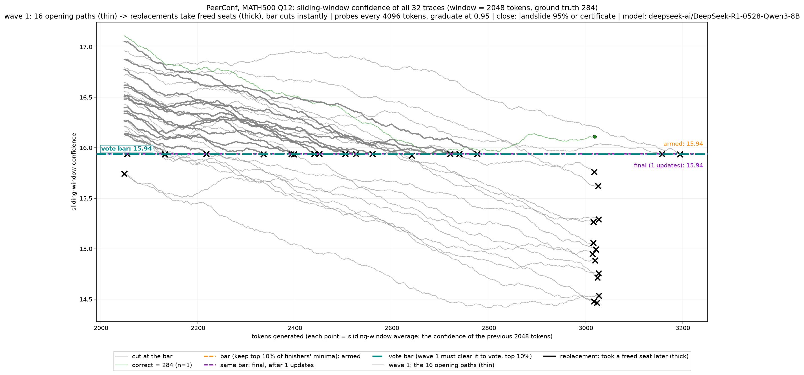
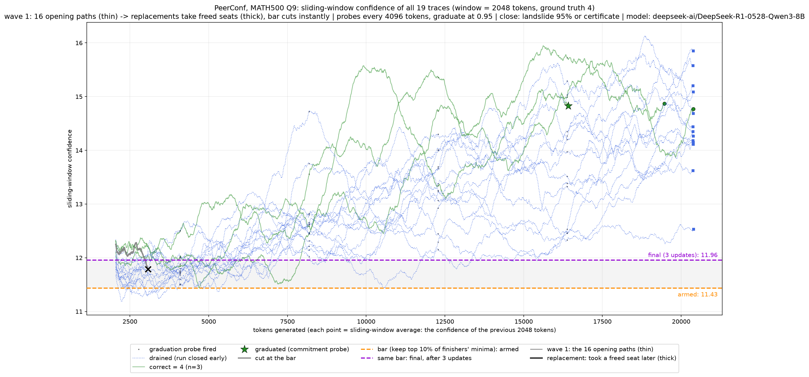
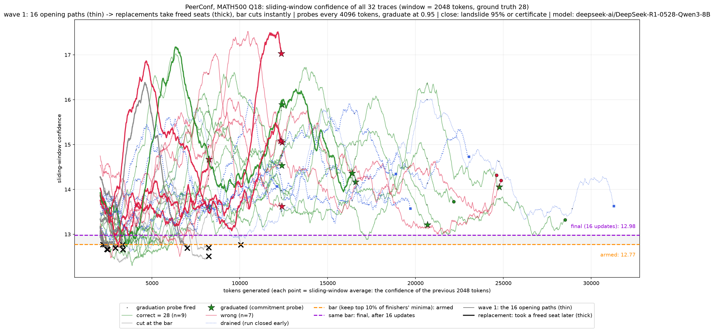

# MATH-500 — the cases worth talking about

From the PeerConf run on Q0–Q24 at `WINDOW = 2048` (see `README.md` for the summary
table). These are the questions where the method behaved in ways the headline numbers
hide. Charts for each are in `timelines/`.

---

## 1. Q12 and Q15 — the vote had one ballot

| | Q12 | Q15 |
|---|---|---|
| gold | 284 | 6 − 5i | 
| launched | 32 | 32 |
| **cut at the bar** | **31** | **31** |
| finished | 1 | 1 |
| tokens | 87,572 | 87,966 |
| tokens on cut traces | 84,554 (**97%**) | 84,701 (**96%**) |

Both were answered correctly, and both are reported as wins. But **31 of 32 traces were
killed and the final answer rested on a single surviving trace.** Seven voting methods
are reported for each; every one of them is that same lone ballot under a different name.

The mechanism behind it: `BAR_MIN_CALIBRATORS = 1`, so the first trace to finish arms the
bar at its own worst moment. On these two questions the bar armed once and never updated
again (`1 update` in the run log). Every other trace was then measured against a threshold
derived from one sample and cut.

Why here and not elsewhere: trace lengths cluster just above the window — Q12's shortest
trace is exactly 2,048 tokens against a 2,048-token window. A trace that barely exceeds
the window produces only a handful of scores, and its *minimum* over so few samples is
noisy. Arming a kill threshold from one noisy minimum, then applying it to a field of
equally noisy minima, cuts almost everyone.

**This is the most important case in the run.** It got the right answer, so it looks like
a success in the table, but 96% of the compute was spent on traces that were destroyed and
the "vote" was not a vote. If this pattern holds at scale, per-question accuracy is
resting on single traces more often than the aggregate suggests.

---

## 2. Q0, Q13, Q20 — PeerConf switched itself off

| | Q0 | Q13 | Q20 |
|---|---|---|---|
| median trace | 1,081 | 745 | 682 |
| traces with any confidence score | **0/32** | **0/32** | **0/32** |
| bar armed | never | never | never |
| traces cut | 0 | 0 | 0 |
| tokens | 35,286 | 25,165 | 22,929 |

A score only exists once a full 2,048-token window has filled. These questions are easy —
"Evaluate (1+2i)6−3i" — so no trace ever got that long. **With no scores there is no bar,
with no bar nothing is ever judged, and PeerConf degenerates into plain parallel sampling
with majority voting.**

The interesting part is that it did not matter. All three were answered correctly, and
they are the three cheapest questions in the run. **Consensus stopping did all the work** —
15 of 32 traces were drained early on Q13 and Q20 once the leading answer held its share.

So on easy problems the confidence bar contributes nothing and the token saving comes
entirely from the consensus rule. That is worth separating in any results table: two
mechanisms are being credited as one.

These three are omitted from the chart gallery in `README.md` because with zero scores the
figures are blank.

---

## 3. Q9 — 83% of the compute was thrown away

| | |
|---|---|
| gold | 4 |
| tokens | 327,333 (2nd most expensive) |
| finished | 3, all answering 4 |
| **abandoned** | **15, at a mean of 17,781 tokens each** |
| tokens on abandoned traces | 266,724 (**82%**) |

Every trace that produced an answer produced the same one. There was never any
disagreement. But the traces on this question run long and near-identical in length —
median 20,379, max 20,391 — so fifteen of them were each ~18,000 tokens deep when the
third finisher arrived and consensus fired, and all fifteen were drained on the spot.

**The race was decided by unanimous agreement and still cost a third of a million tokens**,
because consensus cannot fire until three traces *finish*, and on this question finishing
takes 20k tokens. The kill came at exactly the moment the work had already been done.

This is the clearest argument in the run for a cheaper early-agreement signal — something
that can act on partial traces rather than waiting for three completions.

---

## 4. Q18 — the expensive one, and the only real disagreement

| | |
|---|---|
| gold | 28 |
| tokens | 427,788 (most expensive; 19% of the entire run) |
| finished | 16 |
| answers | **28 ×9, 56 ×3, 124 ×3, 62 ×1** |
| bar | armed 12.8 → final 13.0, 16 updates |

The only question where the model genuinely disagreed with itself. A geometry problem
about parallel segments and angles, and the wrong answers are not random — 56 is 2×28,
124 and 62 differ by the same factor. These are traces making a consistent geometric
misstep, not noise.

This is the case the method is *for*, and it worked: the bar updated 16 times as evidence
accumulated, 11 traces were cut, and the correct answer won 9 votes to 3. It is also the
only question where the live-updating bar visibly earned its keep, which makes it the best
single illustration of PeerConf versus a frozen threshold.

Worth noting it alone is a fifth of the run's total cost. Mean-tokens-per-question is
carried by this one question, which is an argument for reporting the median as well.

---

## 5. Q0 and Q7 — right answers marked wrong

Both questions counted as failures in the table. Neither is a model error.

**Q0** — gold `\left( 3, \frac{\pi}{2} \right)`, model wrote
`\left(3,\ \dfrac{\pi}{2}\right)` on 17 of 18 finished traces. The same point in polar
coordinates, differing by `\dfrac` versus `\frac` and some spacing.

**Q7** — gold `90^\circ`, model wrote `90`. The same angle, without the degree symbol.

`math_equal` handles each of those differences *in isolation* — `\dfrac{14}{3}` matches
`\frac{14}{3}`, and `6+9i` matches `6 + 9i` — but rejects these combinations. So the true
score is **25/25 while the pipeline reports 23/25**.

This is not specific to our run. Across all 500 MATH-500 gold answers: 14% contain
`\frac` or `\dfrac`, 9% contain a space, 3% carry `^\circ`, 2% are `\text{...}`. **Any
MATH-500 accuracy figure from this pipeline is understated**, in both arms and by an
unknown amount until someone measures it properly.

---

## 6. Q4 — a non-numeric answer, and a near-wipeout

Gold is `\text{Evelyn}` — the question asks which student on a graph has the greatest
average speed, so the answer is a name. 29 of 32 traces were cut, 2 finished, both correct.

Two things to flag. The answer type is a string, not a number, so every numeric comparison
path in the grader and the vote is doing something it was not designed for — it happened to
work here because both survivors wrote the identical string. And this is the third instance
of the near-wipeout pattern from case 1: bar armed after 2 updates, then the field was
destroyed.

---

## What to take to the group

1. **Q12/Q15 first.** A correct answer resting on 1 of 32 traces is not the same result as
   a correct answer with a 9–3 majority, and the table cannot tell them apart. Consider
   reporting surviving-ballot count per question.
2. **Separate the two savings mechanisms.** On easy questions the bar does nothing and
   consensus does everything (cases 2). On hard ones the bar does the work (case 4).
   Crediting one number to "PeerConf" hides which part is earning it.
3. **Q9's 82% waste** is the strongest case for acting on agreement before traces finish.
4. **The grader understates MATH-500 accuracy** and should be fixed before any number from
   this benchmark goes in the paper.
5. `WINDOW = 2048` is an AIME setting. A re-run at 256 is in flight; cases 1 and 2 should
   both change materially, and comparing the two windows is itself a result.
