# MATH-500 — PeerConf (WINDOW = 2048)

**Single arm.** DeepConf crashed on this run, so there is no comparison here yet.

## Results

| Method | Model | Dataset | Token | Acc | Mean token/Q |
|---|---|---|---|---|---|
| PeerConf-low | DeepSeek-8B | MATH500 (Q0-24) | 2.27M | 92.0% | 91K |

Budget 32 traces/question, 16 seats, 64k-token cap, WINDOW 2048, 2x H200. Accuracy is the min-window-weighted vote, graded with `math_equal`.

## Read this before using the numbers

**The confidence window was wider than most traces.** Median trace is 2,335 tokens against a 2048-token window, and a score only exists once a full window fills — so **268 of 659 traces (41%) produced no confidence signal at all** and could never be judged or cut.

On Q0, Q8, Q13, Q20 the bar never armed and nothing was cut. The same cause crashed DeepConf outright: all 16 warm-up traces were shorter than the window, so the percentile got an empty array. These settings are tuned for AIME, where traces run 15k–30k tokens.

**Two questions are graded wrong that the model got right.** Q0's gold is `\left( 3, \frac{\pi}{2} \right)` and the model wrote `\left(3,\ \dfrac{\pi}{2}\right)` on 17 of 18 traces. Q7's gold is `90^\circ`, the model said `90`. `math_equal` rejects both. True score is 25/25; the pipeline reports 23/25.

## Per question

| Q | GT | Answer | Correct | Tokens | Launched | Finished | Cut | Traces w/ signal |
|---|---|---|---|---|---|---|---|---|
| 0 | `\left( 3, \frac{\pi}{2` | `(3,\ \dfrac{\pi}{2})` | **no** | 35,286 | 32 | 18 | 0 | 0/32 |
| 1 | `p - q` | `p - q` | yes | 66,224 | 18 | 3 | 0 | 16/18 |
| 2 | `\frac{14}{3}` | `\dfrac{14}{3}` | yes | 32,951 | 22 | 7 | 0 | 10/22 |
| 3 | `9` | `9` | yes | 32,873 | 29 | 14 | 0 | 4/29 |
| 4 | `\text{Evelyn}` | `\text{Evelyn}` | yes | 103,089 | 32 | 2 | 29 | 32/32 |
| 5 | `42` | `42` | yes | 44,953 | 22 | 3 | 4 | 15/22 |
| 6 | `27` | `27` | yes | 65,530 | 20 | 3 | 2 | 16/20 |
| 7 | `90^\circ` | `90` | **no** | 66,128 | 22 | 3 | 4 | 16/22 |
| 8 | `3\sqrt{13}` | `3\sqrt{13}` | yes | 34,981 | 32 | 17 | 0 | 1/32 |
| 9 | `4` | `4` | yes | 327,333 | 19 | 3 | 1 | 17/19 |
| 10 | `2220` | `2220` | yes | 131,520 | 27 | 3 | 9 | 21/27 |
| 11 | `\frac{3}{56}` | `\dfrac{3}{56}` | yes | 131,332 | 30 | 3 | 12 | 21/30 |
| 12 | `284` | `284` | yes | 87,572 | 32 | 1 | 31 | 32/32 |
| 13 | `5` | `5` | yes | 25,165 | 32 | 17 | 0 | 0/32 |
| 14 | `\sqrt{51}` | `\sqrt{51}` | yes | 56,432 | 25 | 3 | 7 | 16/25 |
| 15 | `6 - 5i` | `6-5i` | yes | 87,966 | 32 | 1 | 31 | 32/32 |
| 16 | `-50` | `-50` | yes | 33,656 | 21 | 6 | 0 | 11/21 |
| 17 | `\pi` | `\pi` | yes | 131,367 | 22 | 3 | 4 | 19/22 |
| 18 | `28` | `28` | yes | 427,788 | 32 | 16 | 11 | 32/32 |
| 19 | `3` | `3` | yes | 66,023 | 29 | 3 | 11 | 16/29 |
| 20 | `6+9i` | `6+9i` | yes | 22,929 | 32 | 17 | 0 | 0/32 |
| 21 | `13535` | `13535` | yes | 66,308 | 20 | 3 | 2 | 16/20 |
| 22 | `5` | `5` | yes | 73,766 | 31 | 3 | 13 | 16/31 |
| 23 | `x=5` | `5` | yes | 50,527 | 28 | 3 | 10 | 16/28 |
| 24 | `10` | `10` | yes | 65,704 | 18 | 3 | 0 | 16/18 |

## Confidence timelines

One figure per question: every trace's sliding-window confidence over its life, coloured by outcome, with the bar's armed and final levels.

Q0, Q13, Q20 are omitted — no trace in them produced a single confidence score, so those figures are blank.

### Q1 — correct, 66,224 tokens, 16/18 traces with signal

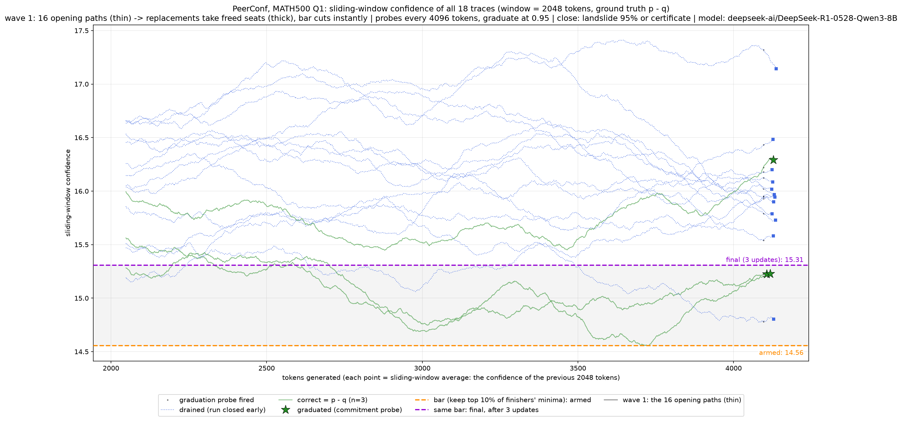

### Q2 — correct, 32,951 tokens, 10/22 traces with signal

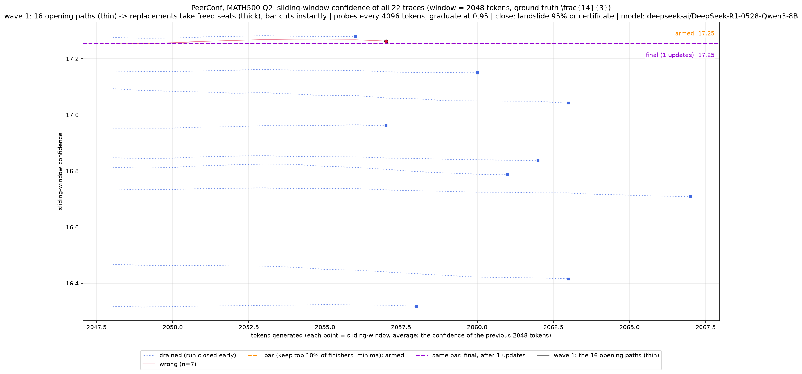

### Q3 — correct, 32,873 tokens, 4/29 traces with signal

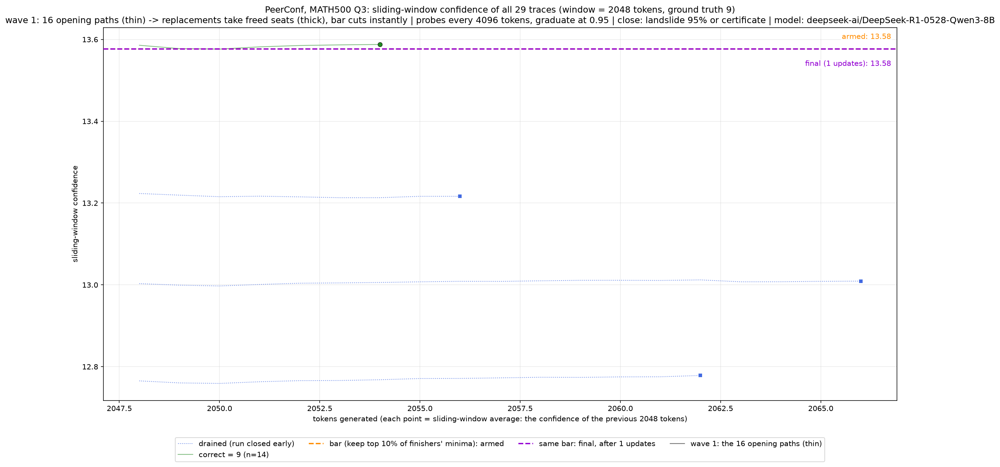

### Q4 — correct, 103,089 tokens, 32/32 traces with signal

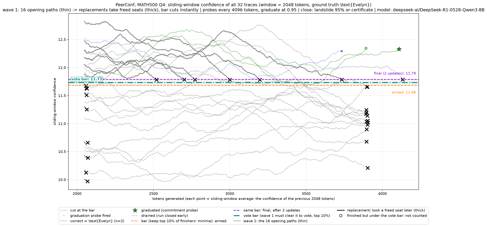

### Q5 — correct, 44,953 tokens, 15/22 traces with signal

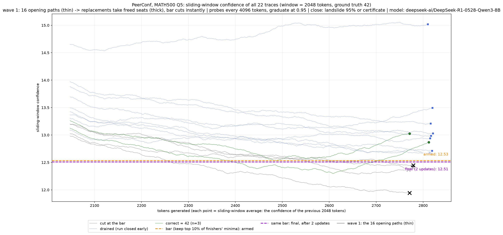

### Q6 — correct, 65,530 tokens, 16/20 traces with signal

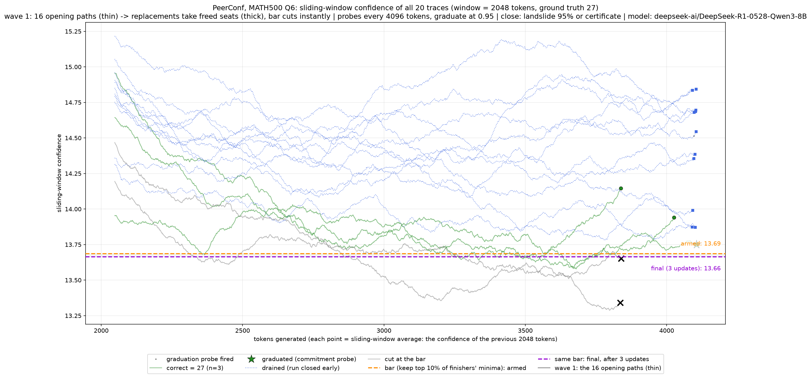

### Q7 — WRONG, 66,128 tokens, 16/22 traces with signal

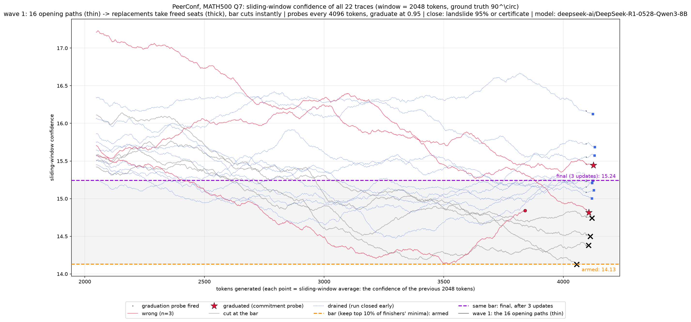

### Q8 — correct, 34,981 tokens, 1/32 traces with signal  *(only one trace had signal — nearly blank)*

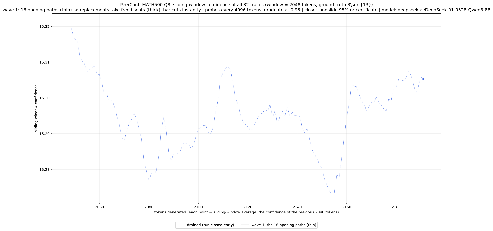

### Q9 — correct, 327,333 tokens, 17/19 traces with signal

### Q10 — correct, 131,520 tokens, 21/27 traces with signal

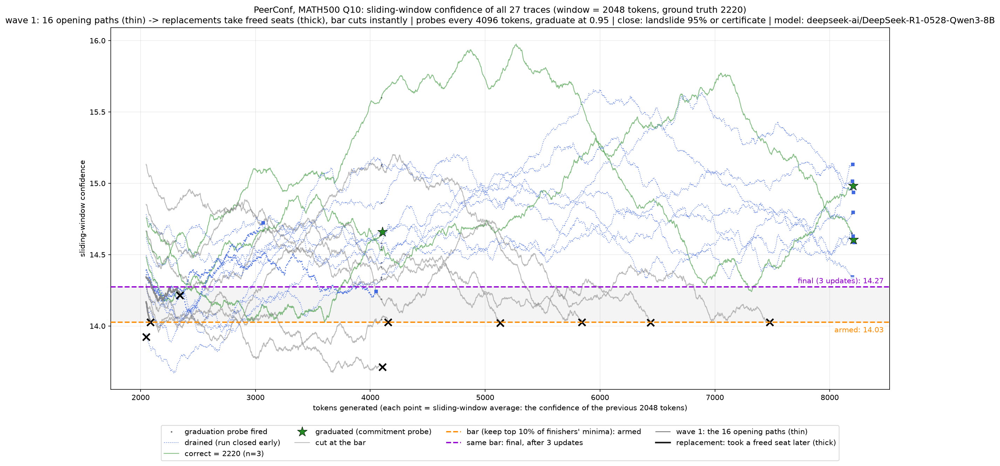

### Q11 — correct, 131,332 tokens, 21/30 traces with signal

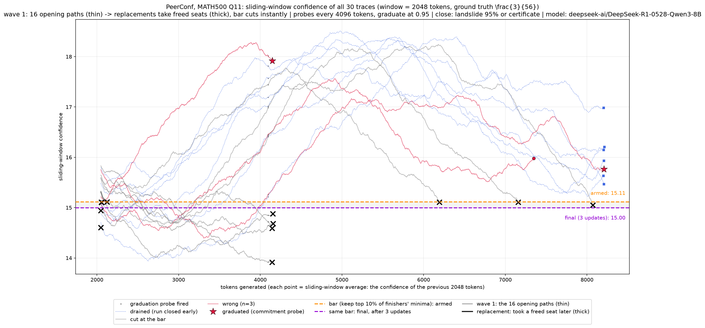

### Q12 — correct, 87,572 tokens, 32/32 traces with signal

### Q14 — correct, 56,432 tokens, 16/25 traces with signal

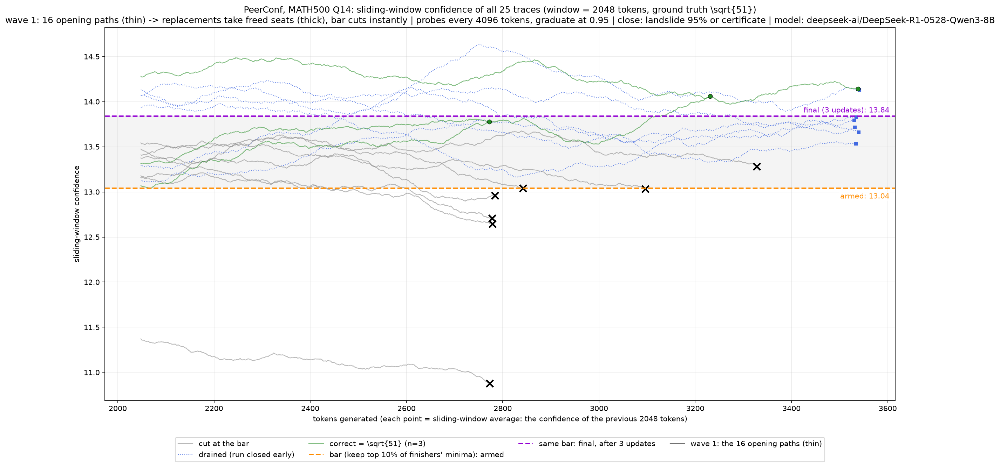

### Q15 — correct, 87,966 tokens, 32/32 traces with signal

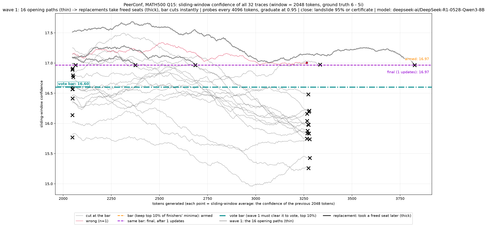

### Q16 — correct, 33,656 tokens, 11/21 traces with signal

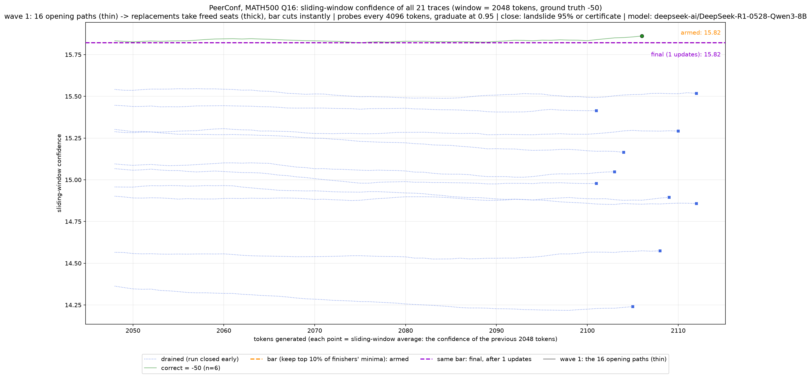

### Q17 — correct, 131,367 tokens, 19/22 traces with signal

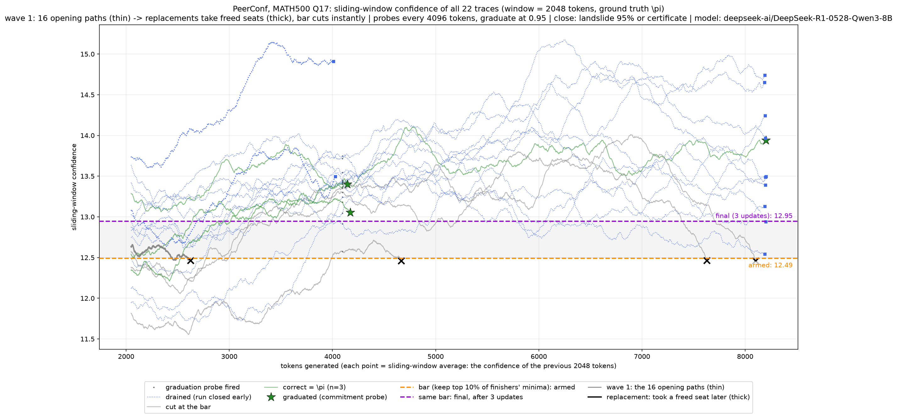

### Q18 — correct, 427,788 tokens, 32/32 traces with signal

### Q19 — correct, 66,023 tokens, 16/29 traces with signal

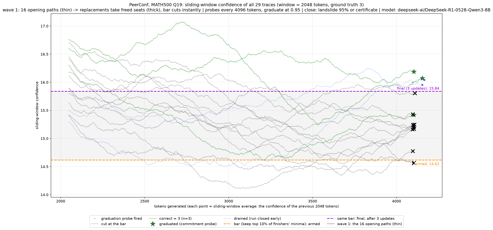

### Q21 — correct, 66,308 tokens, 16/20 traces with signal

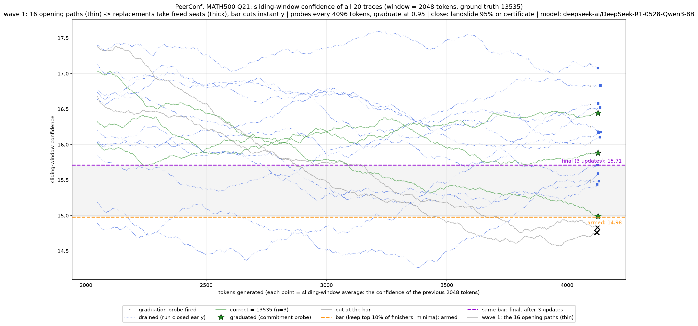

### Q22 — correct, 73,766 tokens, 16/31 traces with signal

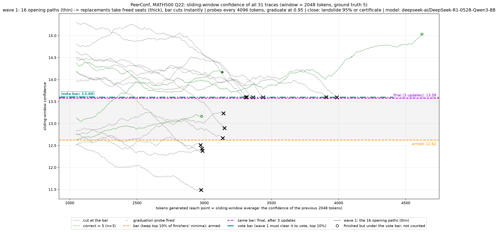

### Q23 — correct, 50,527 tokens, 16/28 traces with signal

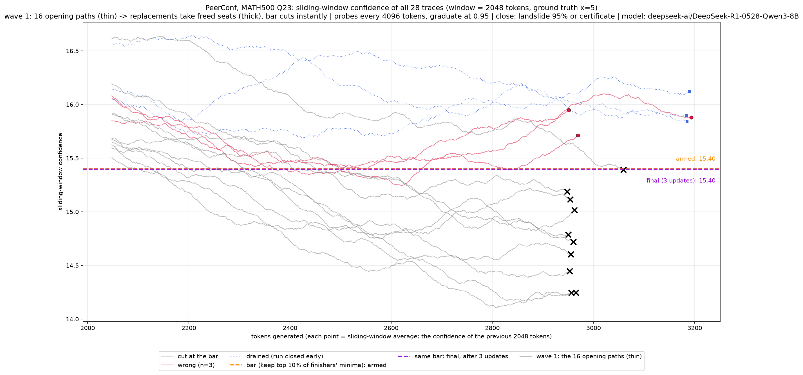

### Q24 — correct, 65,704 tokens, 16/18 traces with signal

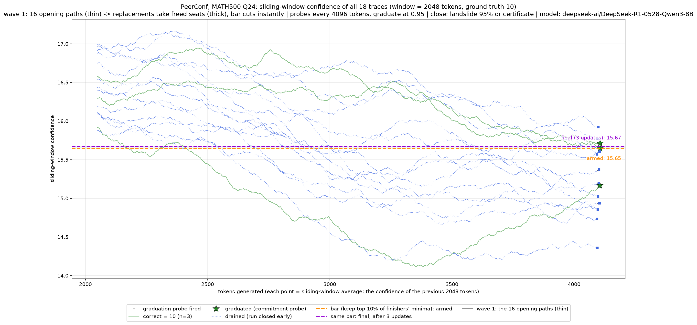

